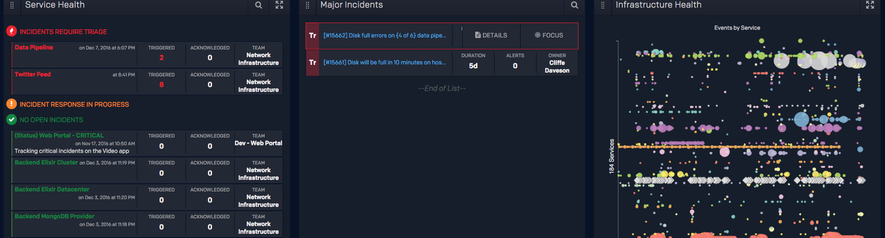

Although the above practices are effective regardless of any platform, it can help to see how these concepts are applied in practice. This section shows how [PagerDuty](https://pagerduty.com) can be used to practice the steps recommended in this guide.

!!!tip "Incident Response"
    If you are not a PagerDuty customer, you can safely skip this section. This section is here to help PagerDuty customers jumpstart implementation of Operational Reviews with rich metrics and analytic capabilities that are baked into the platform. Nothing about the review process itself, other than how you gather metrics, is different if you are not a PagerDuty customer.

If you are one of the more than 10,000 companies across the globe that uses PagerDuty to manage real-time operations, there are a number of capabilities, features, and products that can support your efforts to run regular operational reviews, including making it easy to collect metrics and improve the richness of those metrics.

## PagerDuty Analytics
[PagerDuty Analytics](https://www.pagerduty.com/features/analytics) offers a feature called Operational Review Analytics. This feature was designed to be a companion to this Operational Review Documentation and align directly to the three most common operational reviews run at digital businesses by providing a rich and prescriptive set of analytic capabilities. Three reports are accessible in the PagerDuty web application, which can be customized by adjusting the timeframe of the reports, as well as the Team, Service, and/or Organization scope. Additionally, these reports can be scheduled for delivery to your email inbox.

## PagerDuty Platform Reporting
Even if you are not yet using the PagerDuty Analytics product, you can still find a wealth of information and metrics within the [PagerDuty platform](https://www.pagerduty.com/features/#advanced-analytics). PagerDuty Analytics offers up to five distinct reports, surfacing every incident and alert, along with basic metrics across the system, teams, users, and escalation policies. Report availability depends on your PagerDuty platform license type.

## Team & Service Configuration
In order to run focused Operational Review meetings with metrics available via PagerDuty, it is critical to have your on-call and incident management settings structured in a way that leads to proper visibility into the data. The two most important configurations are around your Teams and PagerDuty Services.

For Teams, make sure that all users in your PagerDuty account are part of at least one team. Set up your PagerDuty teams to mirror your software development/delivery teams. If a group of people in your company wholly owns a technical service, that group of people should be a team in PagerDuty. Make sure the team’s manager is set up as a member of the team, and use the team roles feature to signal that they are the manager. You can learn more about setting up teams from our [Teams Knowledge Base page](https://support.pagerduty.com/docs/teams).

For Services, there are many ways to set up your PagerDuty instance, but the method that provides the best visibility into meaningful metrics is to set up one PagerDuty service for every distinct piece of software you manage. All monitoring for that software should be directed to the same service in PagerDuty, and you’ll want to ensure that there is clear team ownership of that service assigned in PagerDuty. See [this blog post](https://www.pagerduty.com/blog/best-practice-service-taxonomies/) for best practices around setting up Services, and our [Services and Integrations Knowledge Base page](https://support.pagerduty.com/docs/services-and-integrations) for how to configure services.

## Modern Incident Response
Using PagerDuty to manage major incidents can help you reduce customer-impacting downtime, but it can also increase the richness of the data and metrics which are useful to running your Operational Reviews. PagerDuty’s [Modern Incident Response](https://www.pagerduty.com/features/modern-incident-response/) product offers features such as incident priority, collaboration for multiple responders, automation, stakeholder updates, and more. These features enrich the service health details along with additional data that can surface insights into your incident response processes.

!!!tip "Incident Response"
    Don't forget to ensure your major incident response process is up-to-date using [our open source incident response documentation](https://response.pagerduty.com).
